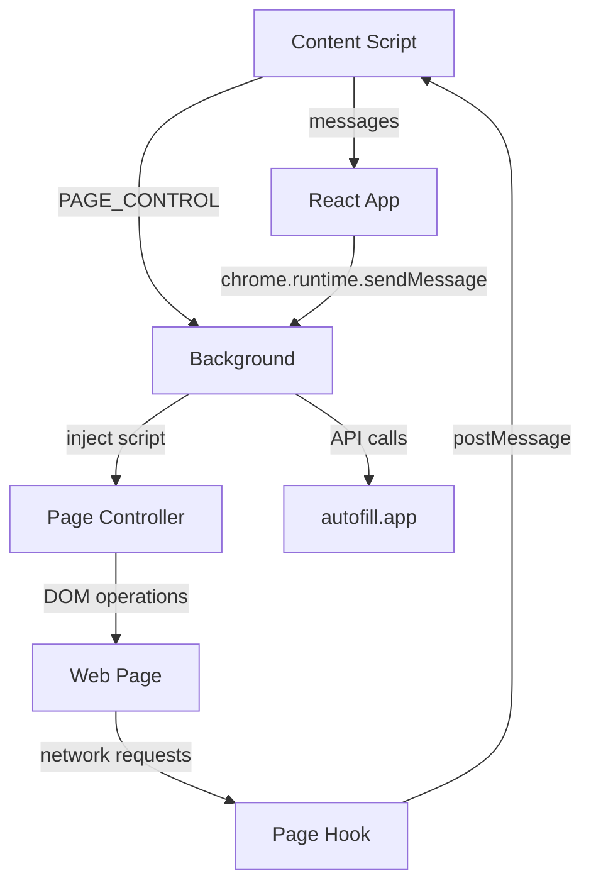

# autofill Chrome Extension - Architecture Documentation

## Overview

**autofill** (v2.0.1) is a Chrome extension for Twitter/X automation and data extraction. It intercepts network requests, provides tab management, and includes AI-powered features.

## Project Structure

```
├── manifest.json              # Extension manifest
├── background.js              # Service worker (background script)
├── page-hook.js               # Network interception hook
├── popup.html                 # Extension popup UI
├── sidepanel.html             # Side panel UI
├── options.html               # Options/settings page
├── content-scripts/
│   ├── content.js            # Main content script (474KB)
│   ├── page-controller.js    # Page automation controller (92KB)
│   └── content.css           # Content styles
└── chunks/
    ├── App-To6X2FIZ.js       # Main React app (727KB)
    ├── AITab-BdMoWPVG.js     # AI Tab component (227KB)
    ├── popup-D-fM3KWM.js     # Popup entry
    ├── sidepanel-BT0a9Ul4.js # Side panel entry
    └── options-BsQtVbzY.js   # Options entry
```

## Core Components

### 1. Background Service Worker (`background.js`)

**Purpose**: Central hub for authentication, tab management, and message routing.

**Key Functions**:

| Function | Purpose |
|----------|---------|
| `T(e)` | Save auth token to storage |
| `S()` | Retrieve auth token from storage |
| `P()` | Generate/get client ID |
| `C(e)` | Inject page-controller.js into tab |
| `A(e,r,i)` | Handle PAGE_CONTROL messages |
| `L(e,r)` | Handle TAB_CONTROL messages (tab operations) |
| `v()` | Setup tab event listeners |
| `O()` | OAuth authentication flow |

**Message Types Handled**:

| Type | Action |
|------|--------|
| `TAB_CONTROL` | Tab management operations |
| `PAGE_CONTROL` | Page automation commands |
| `auth.start` | Start OAuth flow |
| `x:open-panel` | Open side panel |
| `contextMenu:toggle` | Toggle context menu |
| `plugin:toggle` | Toggle plugin status |
| `autoDetect:toggle` | Toggle auto-detect |
| `getWebsites` | Fetch websites from API |
| `fetchImage` | Fetch image as data URL |

**Tab Control Actions**:
- `get_active_tab` - Get current active tab
- `get_tab_info` - Get tab information
- `open_new_tab` - Create new tab
- `create_tab_group` - Create tab group
- `update_tab_group` - Update tab group properties
- `add_tab_to_group` - Add tab to group
- `close_tab` - Close tab

**API Integration**:
- Base URL: `https://autofill.app/api`
- OAuth endpoint: `/auth/signin`
- Client auth: `/auth/client`
- Websites: `/websites`

### 2. Page Hook (`page-hook.js`)

**Purpose**: Intercept and capture Twitter/X network requests.

**Functions**:

| Function | Purpose |
|----------|---------|
| `post(payload)` | Send message via postMessage |
| `normalizeUrl(input)` | Normalize URL |
| `shouldCapture(url)` | Check if URL should be captured |
| `captureResponse(url, status, body)` | Capture response data |
| `readBody(xhr)` | Read XHR response body |

**Hooks Installed**:
- `XMLHttpRequest.prototype.open` - Capture URL
- `XMLHttpRequest.prototype.send` - Capture response
- `window.fetch` - Capture fetch API calls

**Capture Conditions**:
- URLs matching `/\/dm\//i` (direct messages)
- URLs matching `/graphql\/[^/]+\//i` (GraphQL requests)

### 3. Page Controller (`page-controller.js`)

**Purpose**: Automate page interactions (click, type, navigate, etc.).

**Key Functions**:

| Function | Purpose |
|----------|---------|
| `waitFor(seconds)` | Delay execution |
| `movePointerToElement(element)` | Move pointer to element center |
| `getElementByIndex(map, index)` | Get element by index |
| `blurLastClickedElement()` | Blur previous clicked element |
| `clickElement(element)` | Click element with pointer animation |
| `typeText(element, text)` | Type text into element |
| `selectOption(element, values)` | Select dropdown option |
| `fillForm(fields)` | Fill multiple form fields |
| `handleDialog(action, promptText)` | Handle alert/confirm/prompt |
| `scrollPage(direction)` | Scroll page |
| `navigate(url)` | Navigate to URL |
| `browserSnapshot()` | Capture accessibility tree |
| `evaluate(function)` | Execute JavaScript |
| `getConsoleMessages(level)` | Get console messages |
| `getNetworkRequests(includeStatic)` | Get network requests |
| `uploadFiles(paths)` | Upload files |

### 4. Content Script (`content.js`)

**Purpose**: Main content script for Twitter/X interaction.

**Features**:
- Twitter/X DOM interaction
- Data extraction from tweets
- User timeline scraping
- Media handling
- Message passing to/from background

### 5. React App (`chunks/App-To6X2FIZ.js`)

**Purpose**: Main React application (727KB).

**Likely Components**:
- Authentication UI
- Settings management
- Data visualization
- Twitter/X account management
- AI features interface

### 6. AI Tab (`chunks/AITab-BdMoWPVG.js`)

**Purpose**: AI-powered features (227KB).

**Likely Features**:
- Content generation
- Tweet automation
- Sentiment analysis
- Smart replies

## Message Flow



## Data Flow

### Authentication Flow
```
User → UI (React) → auth.start message → Background
Background → OAuth Tab → autofill.app/auth/signin
Background → polling → /auth/client
Background → save token → chrome.storage.local
```

### Data Capture Flow
```
Twitter/X → XHR/Fetch → Page Hook (intercepts)
Page Hook → postMessage → Content Script
Content Script → chrome.runtime.sendMessage → Background
Background → Process/Store → React App
```

### Tab Management Flow
```
UI → TAB_CONTROL message → Background
Background → chrome.tabs API → Browser
Browser → Tab events → Background
Background → TAB_CHANGE message → UI
```

## Storage

### chrome.storage.local Keys
| Key | Purpose |
|-----|---------|
| `auth.token` | OAuth access token |
| `auth.client_id` | Client identifier |
| `pluginEnabled` | Plugin enabled state |
| `contextMenuEnabled` | Context menu enabled |
| `autoDetect` | Auto-detect feature |

### localStorage Keys
| Key | Purpose |
|-----|---------|
| `auth.client_id` | Client identifier backup |

## Permissions

| Permission | Usage |
|------------|-------|
| `storage` | Store auth tokens, settings |
| `sidePanel` | Side panel UI |
| `scripting` | Inject page controller |
| `tabs` | Tab management |
| `contextMenus` | Context menu integration |

## Host Permissions

| Host | Purpose |
|------|---------|
| `https://autofill.app/*` | API communication |
| `https://twitter.com/*` | Twitter interaction |
| `*://x.com/*` | X.com interaction |
| `*://mobile.x.com/*` | Mobile X interaction |
| `https://twibird.com/*` | Third-party Twitter client |

## Security Considerations

1. **OAuth Flow**: Uses PKCE-like flow with client_id
2. **Token Storage**: Encrypted in chrome.storage.local
3. **Network Interception**: Only captures specific endpoints
4. **CSP**: Web-accessible resources restricted to specific scripts

## External Dependencies

**Inferred from code**:
- React (UI framework)
- Lucide React (icons)
- Zod (validation)
- Chrome Extension APIs

## Build Output

The extension is built with:
- Code minification and mangling
- Chunk splitting (webpack/vite)
- Variable name obfuscation
- Tree shaking

---

*Generated by source code analysis*
